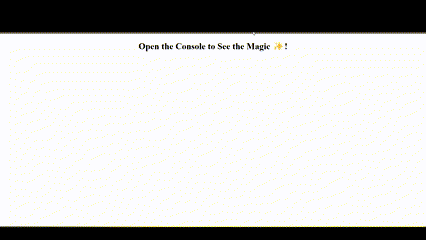

# Console-Finances


## Overview

Welcome!
 This repo  ia have used my my newly learnt Java skills along side some personal knowledge research to create code for analyzing the financial records of a company. For this analysis, a financial dataset file has was provided. In summary, this code calculates and logs the total number of months, total profit/loss, average change, and the months with the greatest increase and decrease in profits/losses based on the given financial dataset.


## Project Goals

The primary goal for this project  is to have a resulting analysis should look similar to the following printed to teh console:

  ```text
  Financial Analysis 
  ----------------
  Total Months: 86
  Total: $38382578
  Average Change: -2315.12
  Greatest Increase in Profits/Losses: Feb-2012 ($1926159)
  Greatest Decrease in Profits/Losses: Sep-2013 ($-2196167)
  ```

### Acceptance Criteria

    1. Create a new GitHub repo called `Console-Finances`. Then, clone it to my computer.
    
    2. Copy the starter files in my local git repository.

        A dataset composed of arrays with two fields, Date and Profit/Losses.

        My task is to write JavaScript code that analyzes the records to calculate each of the following:

            * The total number of months included in the dataset.

            * The net total amount of Profit/Losses over the entire period.

            * The average of the **changes** in Profit/Losses over the entire period.

            * Track what the total change in Profit/Losses are from month to month and then find the average.

            * (`Total/(Number of months - 1)`)

            * The greatest increase in Profit/Losses (date and difference in the amounts) over the entire period.

            * The greatest decrease in Profit/Losses (date and difference in the amounts) over the entire period.

## Getting started

### Prerequisites
Before starting this project, i made sure i familiarize myself with the acceptance criteria and understood the requirement.

I also made sure asset were in the correct folder. 

i also spent some time doing research of best methods of calculation to use.

## Usage

This webpage can be accessed by [**clicking here**](https://dalabi91.github.io/Console-Finances/)

The following animation shows shows how to access the analysis report



## Analysis Report


## Resource

- [**W3 School**](https://www.w3schools.com/)
- [**MDN Web Docs**](https://developer.mozilla.org/)


## License

This project is licensed under the MIT License.


## Badges

[](https://opensource.org/licenses/MIT)
